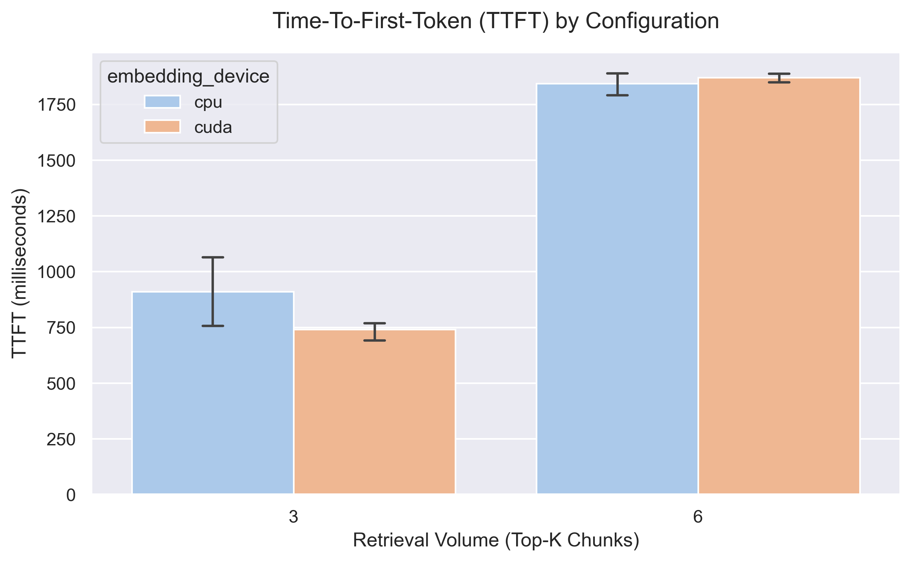
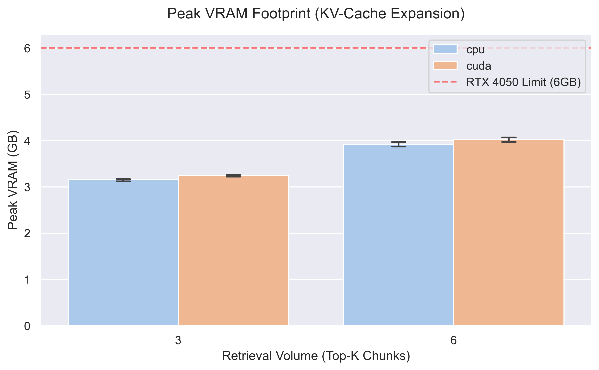
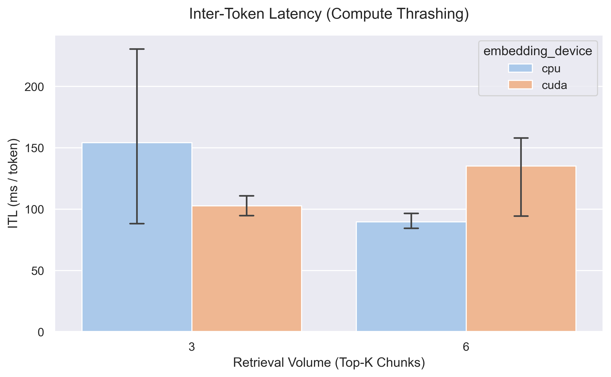

# Engineering Log: Days 4 - 5

## **Focus:** Matrix Benchmarking & KV-Cache Scaling Constraints

### 1. The Objective
To empirically determine the optimal hardware configuration for the Phi-4-mini inference engine on an RTX 4050 (6GB VRAM). I executed an automated 12-path benchmark matrix altering context volume (`k=3` vs `k=6`) and embedding model placement (`cpu` vs `cuda`).

### 2. Benchmark Data (Aggregated Averages)

| Config (Embed + K) | Avg TTFT (ms) | Avg ITL (ms/token) | Avg Peak VRAM (GB) | VRAM Delta |
| :--- | :--- | :--- | :--- | :--- |
| `cpu` + `k=3` | ~910.05* | ~115.95 | 3.15 | -0.02 MB |
| `cpu` + `k=6` | 1843.51 | 89.66 | 3.92 | -0.03 MB |
| `cuda` + `k=3` | 740.88 | 102.63 | 3.24 | -0.02 MB |
| `cuda` + `k=6` | 1868.99 | 135.09 | 4.02 | -0.03 MB |

*(Note: Excluded query 1 from the `cpu` + `k=3` TTFT average to account for initial PyTorch CUDA context initialization/warmup).*

## 3. Architectural Findings & Visualizations

**The KV-Cache Memory Tax** Doubling the FAISS retrieval chunks from `k=3` to `k=6` introduced a massive compute and memory bottleneck. The prompt length tax caused Time-To-First-Token (TTFT) to inflate by over 2x (from ~910ms to ~1843ms). Additionally, holding the expanded context in the attention mechanism's KV-cache permanently consumed an additional ~800 MB of VRAM.

**The Embedding Device Illusion**
Shifting the `sentence-transformers` embedding model from `CPU` to `CUDA` yielded negligible retrieval speedups (hovering around 11-20ms regardless of device). However, placing it on the GPU cost an extra ~100 MB of baseline VRAM and induced severe compute thrashing during high-load generations (`cuda` + `k=6`). The Inter-Token Latency degraded to ~135ms/token as the embedding model and the Phi-4 model fought for limited memory bandwidth.

## 4. Final System Configuration
Based on empirical testing, the optimal production constraint for my 6GB mobile GPU setup is **embeddings on CPU with retrieval of chunks strictly capped at `k=3`**. This protects the autoregressive generation latency, minimizes VRAM footprint, and prevents context-switching thrashing under concurrent load.